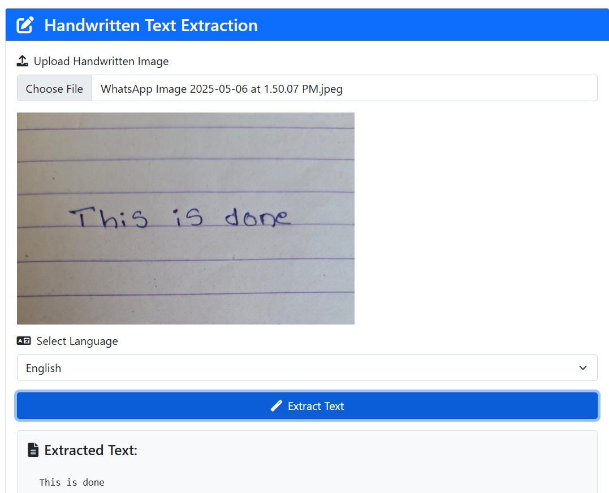

# hand-written-text-detection
# 📝 Handwritten Text Extraction Web App

This is a simple and responsive web application for extracting handwritten or printed text from images using the [OCR.space API](https://ocr.space/OCRAPI). Users can upload an image, select a language, and extract the text using OCR technology.

 

---

## 🔍 Features

- Upload handwritten or printed images
- Supports multiple languages:
  - English
  - French
  - German
  - Spanish
  - Italian
- Displays a preview of the uploaded image
- Extracts and displays text using OCR.space
- Copy extracted text to clipboard
- Responsive UI with Bootstrap 5
- Font Awesome icons for better UX

---

## 🚀 Getting Started

### 1. Clone the Repository

```bash
git clone https://github.com/your-username/handwritten-text-extraction.git
cd handwritten-text-extraction
````

### 2. Open `index.html`

You can run the project by simply opening the `index.html` file in your browser.

> ✅ **Note**: No additional setup or server is required.

---

## 🔐 API Key Setup

This project uses the [OCR.space](https://ocr.space/OCRAPI) API for text extraction.

### Steps:

1. Go to [https://ocr.space/ocrapi](https://ocr.space/ocrapi)
2. Sign up for a free API key
3. Open `index.html` and replace the placeholder:

```javascript
formData.append('apikey', 'YOUR_API_KEY_HERE'); // Replace this
```

> ⚠️ **DO NOT** share your API key publicly. Always keep it secure.

---

## 📁 Project Structure

```
handwritten-text-extraction/
│
├── index.html         # Main application file
├── demo-screenshot.png (optional)
└── README.md          # Project documentation
```

---

## 🛠 Technologies Used

* HTML5
* CSS3
* Bootstrap 5
* JavaScript
* OCR.space API
* Font Awesome

---

## 📷 Sample Images

You can test the app using:

* Scanned handwritten notes
* Photos of notebooks
* Printed documents

---

## 🙌 Acknowledgments

* [OCR.space API](https://ocr.space/OCRAPI) for OCR services
* [Bootstrap](https://getbootstrap.com/)
* [Font Awesome](https://fontawesome.com/)

---

## 📜 License

This project is open-source and available under the [MIT License](LICENSE).
